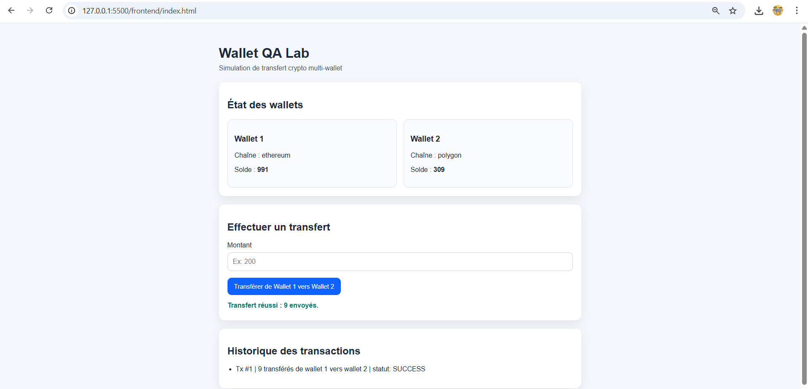
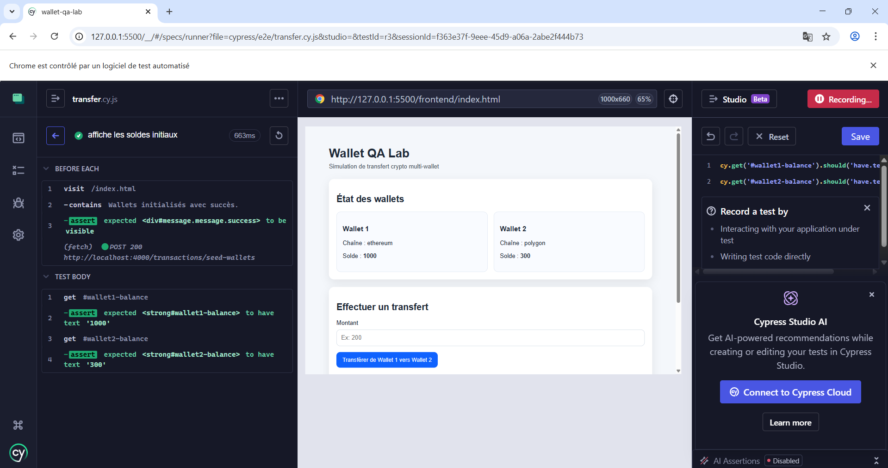
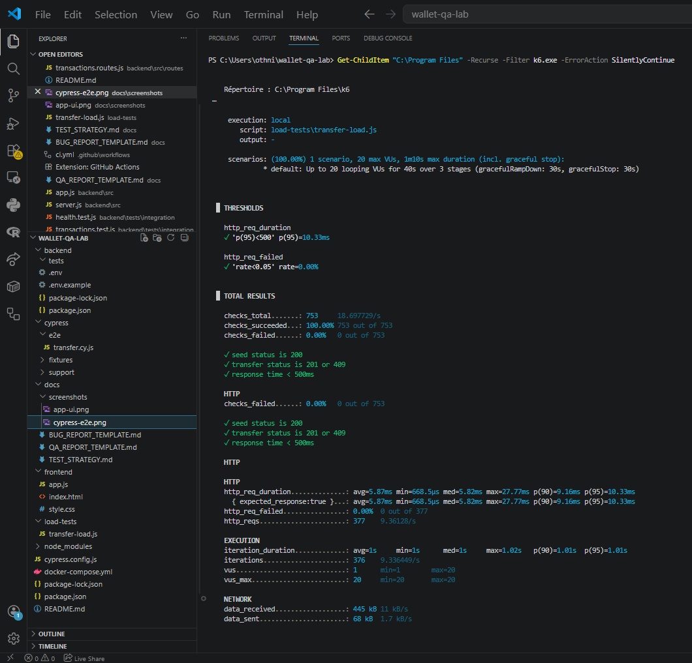
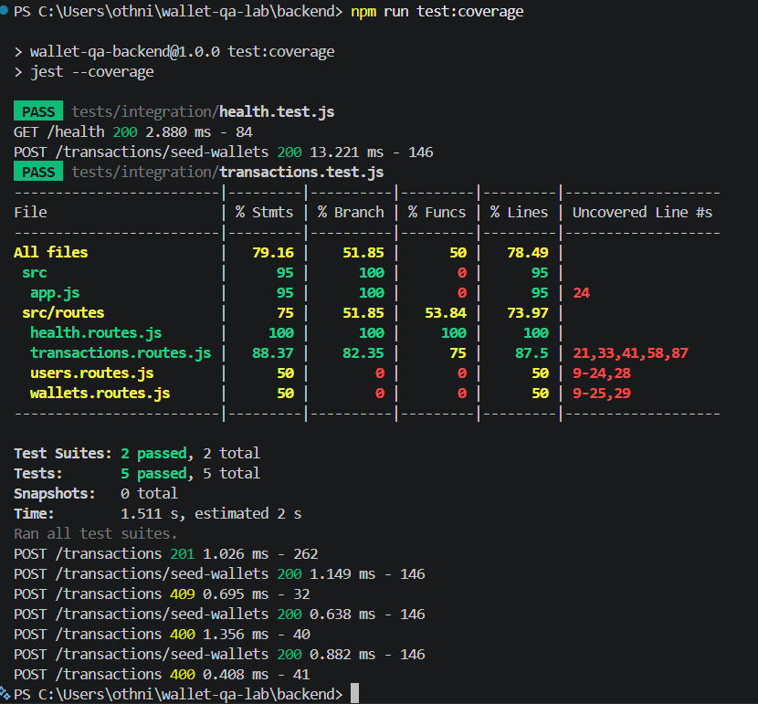

# Wallet QA Lab

A QA automation mini-project designed to demonstrate testing practices for critical fintech/Web3 transaction flows.

## Overview
This project simulates a wallet-to-wallet crypto transfer flow and showcases a layered QA strategy across:
- backend integration testing
- end-to-end web testing
- load testing
- CI quality gates

### Application UI


### Cypress E2E results


### k6 load test results


### Jest backend tests


## Tech stack
- Node.js / Express
- Jest + Supertest
- Cypress
- k6
- GitHub Actions

## Functional scope
- wallet state initialization
- wallet-to-wallet transfer
- business-rule validation
- transaction history display
- deterministic test reset

## Quality coverage

### Backend integration tests
Implemented with Jest and Supertest:
- API healthcheck
- successful transfer
- insufficient balance rejection
- self-transfer rejection
- negative amount rejection

### End-to-end tests
Implemented with Cypress:
- initial balances display
- successful transfer through UI
- invalid amount rejection through UI

### Load testing
Implemented with k6:
- staged virtual-user ramp-up
- latency threshold validation
- failure-rate threshold validation

## Performance result
- p95 latency: 10.33 ms
- failure rate: 0%
- checks passed: 100%

## Project structure
```bash
wallet-qa-lab/
├── .github/
│   └── workflows/
│       └── ci.yml
├── backend/
│   ├── src/
│   │   ├── config/
│   │   │   └── db.js
│   │   ├── controllers/
│   │   ├── middlewares/
│   │   ├── repositories/
│   │   ├── routes/
│   │   │   ├── health.routes.js
│   │   │   ├── transactions.routes.js
│   │   │   ├── users.routes.js
│   │   │   └── wallets.routes.js
│   │   ├── services/
│   │   ├── utils/
│   │   ├── app.js
│   │   └── server.js
│   ├── tests/
│   │   ├── integration/
│   │   │   ├── health.test.js
│   │   │   └── transactions.test.js
│   │   └── unit/
│   ├── .env
│   ├── .env.example
│   ├── package.json
│   └── package-lock.json
├── cypress/
│   └── e2e/
│       └── transfer.cy.js
├── docs/
│   ├── BUG_REPORT_TEMPLATE.md
│   ├── QA_REPORT_TEMPLATE.md
│   ├── TEST_STRATEGY.md
│   └── screenshots/
│       ├── app-ui.png
│       ├── cypress-e2e.png
│       ├── jest-tests.png
│       └── k6-results.png
├── frontend/
│   ├── app.js
│   ├── index.html
│   └── style.css
├── load-tests/
│   └── transfer-load.js
├── cypress.config.js
├── docker-compose.yml
├── package.json
└── README.md
```

## Run locally

### 1. Start the backend
```bash
cd backend
npm install
npm run dev
```

Backend default URL:
```text
http://localhost:4000
```

Health endpoint:
```text
http://localhost:4000/health
```

### 2. Start the frontend
From the project root:
```bash
npx http-server . -p 5500
```

Frontend URL:
```text
http://127.0.0.1:5500/frontend/index.html
```

## Run automated tests

### Backend tests
```bash
cd backend
npm test
```

### Backend coverage
```bash
cd backend
npm run test:coverage
```

### Cypress E2E tests
From the project root:
```bash
npx cypress open
```

Or headless:
```bash
npx cypress run
```

### Load tests
From the project root:
```bash
k6 run load-tests/transfer-load.js
```

## Sample tested scenarios

### Backend
- healthcheck returns service status
- valid transfer updates both wallet balances
- insufficient balance returns an error
- self-transfer is rejected
- negative amount is rejected

### E2E
- initial balances are displayed correctly
- transfer can be executed successfully from the UI
- invalid amount is rejected with visible feedback

### Performance
- progressive load ramp-up
- latency under threshold
- failure rate under threshold

## CI
A GitHub Actions workflow runs backend tests and coverage on push and pull request.

```text
.github/workflows/ci.yml
```

## QA documentation
Additional QA documentation is available in:
- `docs/TEST_STRATEGY.md`

## Current limitations
- no real blockchain integration
- no smart contract execution
- no mobile automation yet
- no PostgreSQL persistence yet
- no security scan automation yet
- no contract testing yet

### Author : Konan Othniel